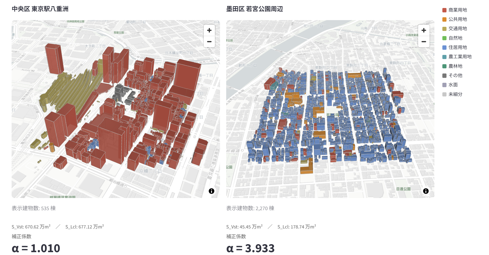

# plateau-space-accessibility-viewer
PLATEAUの3D都市モデルを用いて、任意のエリアの「観光向け／地域向け」の空間特性を可視化・定量比較するStreamlitアプリです。

🔗 **デモ**: [[Streamlit Cloud URL](https://plateau-space-accessibility-viewer.streamlit.app/)]


## 概要
観光客と地域住民では、同じ街であっても「実際に利用できる空間」が異なります。商業施設や公園は原則誰でも利用できますが、住宅地や農地は基本的に地域住民しか利用しません。

この違いを定量化したものが**補正係数α**です。観光客が利用できる空間面積に対する地域住民が利用できる空間面積の比率で、αが大きいほど地域住民向けの空間の割合が大きく、観光客が入り込んだ際の空間的負荷が高いエリアといえます。

詳細な定義・分析結果については以下を参照してください：
- 〔査読論文〕（準備中）

## 機能
**比較モード**
- 地図上で矩形を描くだけで任意のエリアを指定（最大3エリア）
- 複数エリアの補正係数αを並べて比較
- 土地利用カテゴリの色分け表示（3D/2D切替）
- 建物クリックで用途・投影面積・推定延床面積・階数を表示

**詳細モード**
- 基準点・行数・列数・ボックスサイズを指定して分析グリッドを一括配置
- 補正係数αのヒートマップ表示
- 計算結果のCSVエクスポート

## データの準備

PLATEAUのデータは[G空間情報センター](https://www.geospatial.jp/ckan/dataset/plateau)からダウンロードできます。
準備については以下を適宜参考にしてください：
- 〔解説記事〕（準備中）

```
data/
├── bldg/        # 建物GeoJSON（*.geojson）
├── luse/        # 土地利用GeoPackage（*.gpkg）
├── landuse_name_map.csv
├── landuse_category_roots.csv
└── landuse_category_groups.csv
```

## セットアップ

```bash
pip install -r requirements.txt
streamlit run app.py
```

## 対応地域

PLATEAUがLOD1を整備している地域であれば原理的に適用可能です。デモ環境には東京都東京駅周辺のデータを収録しています。
